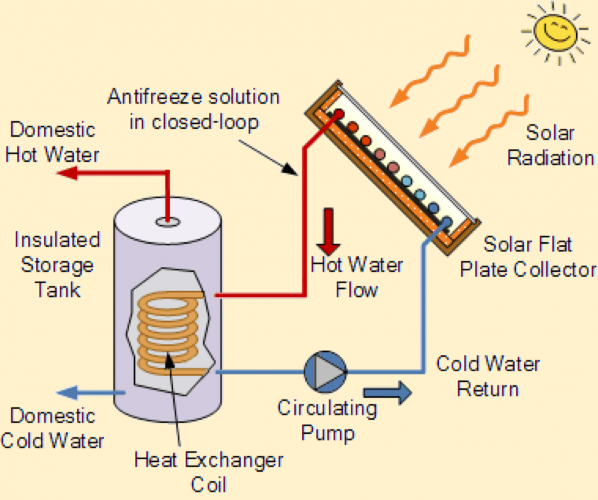

# About
This is a water heating system based on Arduino Nano.
It uses two DS18B20 sensors to decide when to start circulating
the water in the system.

# Hardware
- [Arduino Nano](https://www.arduino.cc/en/pmwiki.php?n=Main/ArduinoBoardNano)
- [Relay](https://arduinogetstarted.com/tutorials/arduino-relay)
- [Temperature Sensors](https://arduinogetstarted.com/tutorials/arduino-temperature-humidity-sensor)
- [Solar collector](images/collector.jpg)
- [Water pump](images/pump.jpg)

# Getting Started
https://chipwired.com/uploading-code-arduino
This is the [article](https://lastminuteengineers.com/multiple-ds18b20-arduino-tutorial) I followed to create this project.